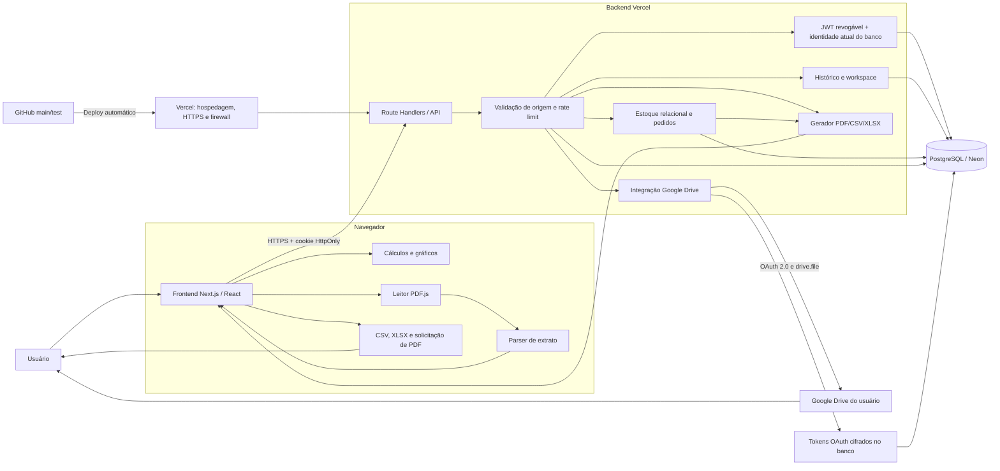
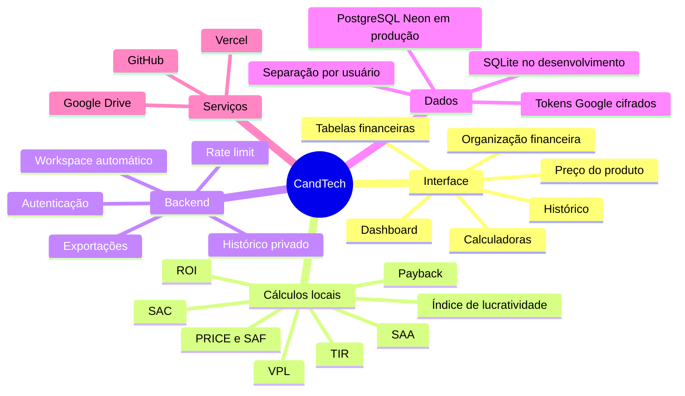
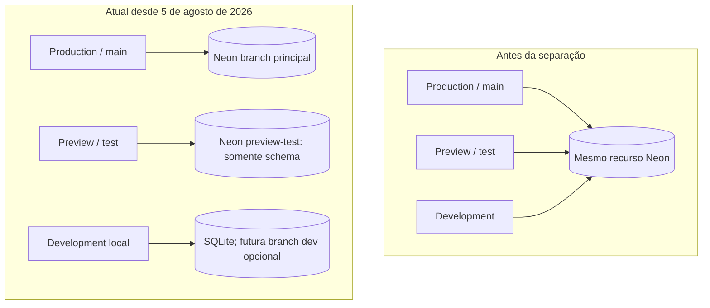

# Mapa do sistema CandTech

O mapa abaixo mostra como navegador, frontend, APIs, banco e serviços externos conversam entre si.

## Leitura como mapa mental

## Limites importantes

- O PDF bruto é processado no navegador; os lançamentos extraídos podem ser salvos no workspace do usuário.
- Os cálculos de investimento são periódicos mensais. As datas identificam os fluxos e a data estimada do payback.
- ROE não pertence ao cálculo de projeto atual. Para calculá-lo corretamente seriam necessários lucro líquido contábil e patrimônio líquido médio.
- PRICE/SAF, SAC e SAA são simulações sem seguros, tarifas, tributos ou indexadores contratuais.

## Funcionamento do banco de dados

### Escolha do backend

`lib/db.js` escolhe o banco no servidor:

1. se `DATABASE_URL` existir, carrega `@neondatabase/serverless` e conecta ao PostgreSQL/Neon;
2. se ela não existir, cria `data/finsight.sqlite` para desenvolvimento local;
3. a Promise de inicialização é reutilizada na mesma instância para evitar inicializações repetidas;
4. `CREATE TABLE IF NOT EXISTS` garante o schema básico, embora migrations versionadas ainda sejam recomendadas antes do uso empresarial.

### Dados persistidos

| Tabela | Conteúdo | Isolamento atual |
| --- | --- | --- |
| `users` | nome, e-mail e hash bcrypt da senha | e-mail único |
| `histories` | documentos e payloads salvos; UUID público para URLs | proprietário da organização derivado da sessão |
| `workspaces` | estado atual e revisão do autosave | uma linha por `user_id` |
| `rate_limits` | contadores temporários de requisição | chave derivada do escopo/origem |
| `google_drive_connections` | refresh token OAuth cifrado | uma linha por `user_id` |
| `auth_sessions` | sessões ativas, expiração e revogação | `user_id` + hash da sessão |
| `billing_profiles` | identificação e endereço de cobrança | uma linha por `user_id` |
| `audit_events` | eventos mínimos de conta, sessão e perfil | `user_id` quando aplicável |
| `organizations` / `organization_jobs` | empresa e modelos de cargos personalizados | proprietário autenticado + `organization_id` |
| `organization_members` / `organization_invitations` | colaboradores, permissões e convites de uso único | `organization_id` resolvido pela sessão |
| `inventory_products` / `inventory_variants` | produto, variação, SKU e saldo | `tenant_id` derivado da sessão e da organização |
| `inventory_batches` / `inventory_movements` | livro de movimentos e reversões | `tenant_id` + autor autenticado |
| `inventory_orders` / `inventory_order_items` | vendas e compras multi-item | `tenant_id` + lote de movimentação |

O navegador conversa apenas com as APIs. A API valida o cookie de sessão, extrai o identificador do usuário e consulta o Neon usando esse identificador. A credencial do banco permanece no servidor.

### Autenticação e proteção contra IDOR

- cadastro e login são as únicas APIs públicas, pois criam a sessão;
- todas as outras APIs validam o JWT em cookie `HttpOnly` e confirmam a sessão persistida, não revogada e dentro da expiração absoluta;
- após validar o token, nome, e-mail e tipo de conta são recarregados da tabela `users`, evitando decisões com atributos antigos gravados no JWT;
- `organizationId`, papel, permissões e proprietário dos dados são resolvidos no servidor; identificadores enviados pelo navegador nunca escolhem livremente a empresa;
- `/api/inventory/export` não recebe ID de usuário, empresa ou estoque; download e envio ao Drive usam o `tenant_id` resolvido a partir da sessão JWT;
- documentos usam `public_id` em formato UUID nas URLs e mantêm o `id` sequencial apenas como chave interna;
- leitura, alteração, exclusão e exportação procuram simultaneamente `public_id` e proprietário da organização;
- trocar o UUID na URL não revela se o registro pertence a outra empresa: a resposta é `404`;
- consulta de convite exige sessão e só revela detalhes quando o e-mail atual da conta corresponde ao e-mail convidado;
- criação e alteração de cargos exigem o proprietário autenticado; convites recebem o cargo consultado no servidor, sem confiar em permissões enviadas livremente pelo navegador;
- o link do convite usa token aleatório de uso único, expira em 72 horas e só é aceito após autenticação com o mesmo e-mail destinatário.

O UUID reduz enumeração, mas não substitui autorização. O isolamento efetivo vem do escopo de proprietário/organização aplicado em todas as consultas.

### Ambientes atuais e destino planejado

## Cadastro, assinatura e cobrança

- `/assinar` apresenta o plano de R$ 60/mês e a implantação única de R$ 120;
- `/api/stripe/checkout` cria uma sessão hospedada com os preços definidos no servidor;
- `/api/stripe/portal` abre o portal de gestão da assinatura para o proprietário;
- `/api/stripe/webhook` valida a assinatura do evento, deduplica e consulta o estado mais recente da assinatura antes de persistir;
- `/api/profile` grava somente nome, contato e endereço do usuário autenticado; não coleta CPF/CNPJ nesta preparação;
- `billing_profiles` e o estado da assinatura armazenam apenas referências do provedor; cartão, senha bancária e credenciais de conta não entram na CandTech;
- `auth_sessions` permite expiração absoluta e revogação no logout;
- `audit_events` registra inicialmente conta, sessão e perfil sem copiar documentos completos para os metadados;
- a migração PostgreSQL correspondente está em `migrations/20260806_security_and_billing.sql`;
- a migration `migrations/20260809_history_public_ids.sql` cria, preenche e torna obrigatório o UUID público usado nas URLs de documentos;
- a tela de sucesso não libera acesso; o servidor confirma o resultado pelo webhook assinado e idempotente;
- `BILLING_ENFORCEMENT_ENABLED` permite validar a integração antes de tornar a assinatura obrigatória para acessar o ERP.

Preview recebe sua própria `DATABASE_URL` sensível e não recebe as credenciais da branch de Production. A branch `preview-test` foi criada com schema somente, sem copiar usuários, históricos ou dados financeiros reais. Development não possui credenciais PostgreSQL na Vercel e usa o fallback SQLite, salvo quando o desenvolvedor configura conscientemente uma URL local separada.
