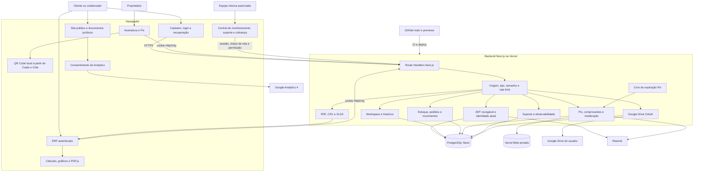
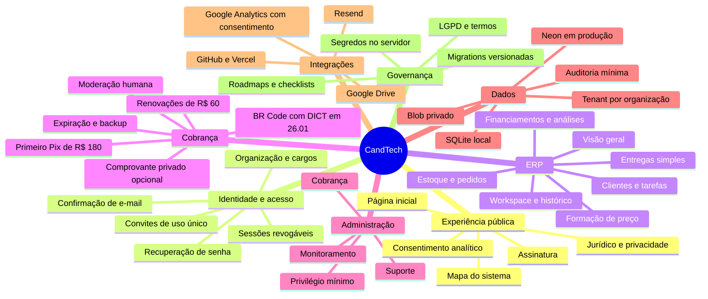
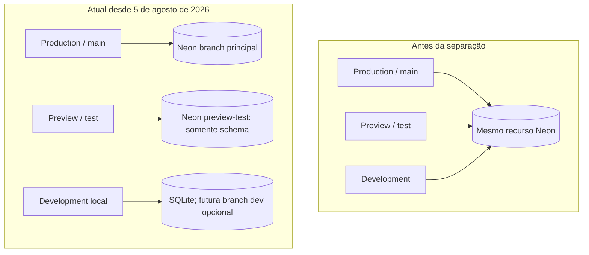
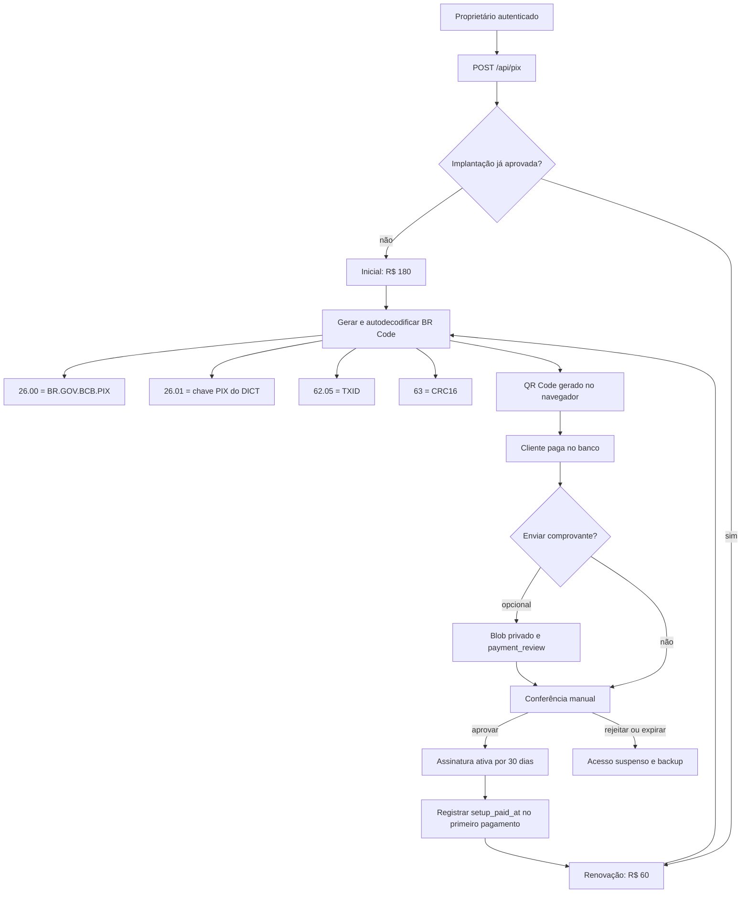

# Mapa do sistema CandTech

O mapa abaixo representa o código publicado em 29 de agosto de 2026: páginas públicas, ERP autenticado, cobrança manual, administração, persistência e integrações externas.

## Leitura como mapa mental

## Limites importantes

- O PDF bruto é processado no navegador; os lançamentos extraídos podem ser salvos no workspace do usuário.
- Os cálculos de investimento são periódicos mensais. As datas identificam os fluxos e a data estimada do payback.
- ROE não pertence ao cálculo de projeto atual. Para calculá-lo corretamente seriam necessários lucro líquido contábil e patrimônio líquido médio.
- PRICE/SAF, SAC e SAA são simulações sem seguros, tarifas, tributos ou indexadores contratuais.

## Funcionamento do banco de dados

### Escolha do backend

`lib/db.js` escolhe o banco no servidor:

1. se `DATABASE_URL` existir, carrega `@neondatabase/serverless` e conecta ao PostgreSQL/Neon;
2. se ela não existir, cria `data/finsight.sqlite` para desenvolvimento local;
3. a Promise de conexão é reutilizada na mesma instância;
4. no PostgreSQL, o schema é preparado antecipadamente pelas migrations versionadas; nenhuma requisição executa `CREATE` ou `ALTER`;
5. somente o SQLite local cria o schema automaticamente para facilitar desenvolvimento e testes.

### Dados persistidos

| Tabela | Conteúdo | Isolamento atual |
| --- | --- | --- |
| `users` | nome, e-mail e hash bcrypt da senha | e-mail único |
| `histories` | documentos e payloads salvos; UUID público para URLs | `user_id` + `organization_id` derivados da sessão |
| `workspaces` | estado atual e revisão do autosave | proprietário + organização; escopo nulo somente para conta pessoal |
| `customers` | carteira relacional, contato, situação e observações | proprietário + `organization_id`; ID público nunca autoriza sozinho |
| `operational_tasks` | tarefas, prazo, prioridade, situação e cliente opcional | proprietário + `organization_id`; FK interna opcional para `customers` |
| `operational_deliveries` | entradas/saídas, prazo, rastreio e conclusão; cliente/pedido opcionais | proprietário + `organization_id`; IDs externos nunca autorizam sozinhos |
| `financial_accounts` | contas de caixa/banco e moeda operacional | proprietário + `organization_id`; nome único dentro do escopo |
| `financial_commitments` | contas a pagar/receber previstas, vencimento, situação e valor | proprietário + `organization_id`; ID público estável |
| `financial_ledger_entries` | entradas/saídas realizadas, origem e vínculo opcional com compromisso | proprietário + `organization_id`; conta e compromisso validados no mesmo escopo |
| `rate_limits` | contadores temporários de requisição | chave derivada do escopo/origem |
| `google_drive_connections` | refresh token OAuth cifrado | uma linha por `user_id` |
| `auth_sessions` | sessões ativas, expiração, revogação e confirmação MFA | `user_id` + hash da sessão |
| `user_mfa` / `mfa_login_challenges` / `mfa_recovery_codes` | segredo TOTP cifrado, desafios e recuperação de uso único | `user_id`; valores sensíveis cifrados ou em hash |
| `billing_profiles` | estado e metadados operacionais da assinatura; a identificação do Pix vem de `users` | uma linha por `user_id` |
| `pix_payment_requests` | valor, tipo inicial/renovação, TXID, prazo e estado da moderação | proprietário autenticado + `public_id` |
| `pix_payment_receipts` | metadados e hash do comprovante armazenado no Blob privado | cobrança pertencente ao proprietário; leitura administrativa autorizada |
| `audit_events` | eventos mínimos de conta, sessão e perfil | `user_id` quando aplicável |
| `organizations` / `organization_jobs` | empresa e modelos de cargos personalizados | proprietário autenticado + `organization_id` |
| `organization_members` / `organization_invitations` | colaboradores, permissões e convites de uso único | `organization_id` resolvido pela sessão |
| `inventory_products` / `inventory_variants` | produto, variação, SKU e saldo | `tenant_id` derivado da sessão e da organização |
| `inventory_batches` / `inventory_movements` | livro de movimentos e reversões | `tenant_id` + autor autenticado |
| `inventory_orders` / `inventory_order_items` | vendas e compras multi-item | `tenant_id` + lote de movimentação |
| `monitoring_events` | incidentes técnicos deduplicados e estados de investigação | somente APIs administrativas; sem payload financeiro |
| `support_tickets` | mensagens de suporte e respostas | usuário da sessão ou equipe com permissão `can_support` |
| `staff_access` | módulos internos concedidos a contas verificadas | administrador principal em `ADMIN_EMAILS` |
| `users.account_status` | separa contas ativas de duplicatas históricas arquivadas | somente servidor |

O navegador conversa apenas com as APIs. A API valida o cookie de sessão, extrai o identificador do usuário e consulta o Neon usando esse identificador. A credencial do banco permanece no servidor.

### Autenticação e proteção contra IDOR

- cadastro e login são as únicas APIs públicas, pois criam a sessão;
- todas as outras APIs validam o JWT em cookie `HttpOnly` e confirmam a sessão persistida, não revogada e dentro da expiração absoluta;
- após a senha, contas com TOTP ativo concluem um desafio persistido, expirável, limitado e consumível; somente então a sessão recebe `mfa_verified_at`;
- proprietários e equipe administrativa sem MFA confirmado não acessam as rotas privilegiadas, mesmo que contornem a interface;
- após validar o token, nome, e-mail e tipo de conta são recarregados da tabela `users`, evitando decisões com atributos antigos gravados no JWT;
- `organizationId`, papel, permissões e proprietário dos dados são resolvidos no servidor; identificadores enviados pelo navegador nunca escolhem livremente a empresa;
- `/api/inventory/export` não recebe ID de usuário, empresa ou estoque; download e envio ao Drive usam o `tenant_id` resolvido a partir da sessão JWT;
- documentos usam `public_id` em formato UUID nas URLs e mantêm o `id` sequencial apenas como chave interna;
- leitura, alteração, exclusão e exportação procuram simultaneamente `public_id` e proprietário da organização;
- trocar o UUID na URL não revela se o registro pertence a outra empresa: a resposta é `404`;
- consulta de convite exige sessão e só revela detalhes quando o e-mail atual da conta corresponde ao e-mail convidado;
- criação e alteração de cargos exigem o proprietário autenticado; convites recebem o cargo consultado no servidor, sem confiar em permissões enviadas livremente pelo navegador;
- o link do convite usa token aleatório de uso único, expira em 72 horas e só é aceito após autenticação com o mesmo e-mail destinatário.

O UUID reduz enumeração, mas não substitui autorização. O isolamento efetivo vem do escopo de proprietário/organização aplicado em todas as consultas.

### Monitoramento e suporte

- `lib/server-observability.js` transforma falhas tratadas das APIs em resumos técnicos persistentes e mantém o log estruturado da Vercel;
- `app/monitoring-client.js` captura falhas não tratadas no navegador, mas a API só aceita registros de uma sessão autenticada e aplica rate limit;
- `/api/support` deriva o autor da sessão e nunca aceita `user_id` ou `organization_id` como autoridade do navegador;
- `/api/admin/monitoring` e a rota dinâmica da central exigem sessão válida, e-mail verificado, aceite jurídico atual e permissão persistida; a chave do caminho é validada com comparação de tempo constante;
- monitoramento, suporte e cobrança são autorizados separadamente também nas APIs, e apenas `ADMIN_EMAILS` pode conceder ou revogar esses acessos;
- `users.email` é normalizado com `trim + lowercase`, possui índice funcional único no PostgreSQL e duplicatas históricas são arquivadas com sessões revogadas, sem apagar seus dados empresariais;
- a central não é listada no sitemap, possui `noindex` e também é bloqueada no `robots.txt`;
- detalhes operacionais e configuração estão em `docs/MONITORAMENTO-E-SUPORTE.md`.

### Ambientes atuais e destino planejado

## Cadastro, assinatura e cobrança

- `/assinar` apresenta o plano de R$ 60/mês e a implantação única de R$ 120;
- `/api/pix` cria ou recupera a solicitação pendente do proprietário autenticado e gera o Pix no servidor;
- `lib/pix.js` monta o Merchant Account Information no template `26`, grava a GUI em `26.00` e a chave DICT em `26.01`, limita o TLV a 99 bytes, calcula o CRC16 e decodifica o resultado antes de devolvê-lo;
- `PIX_KEY` permanece em uma variável `Secret` de Produção. A chave necessariamente entra no BR Code entregue ao pagador autenticado, mas não é publicada no bundle, HTML estático ou variável `NEXT_PUBLIC_`;
- `/api/pix/[paymentId]/receipt` autoriza o proprietário a enviar um comprovante diretamente ao Vercel Blob privado, valida o arquivo no callback e muda a cobrança para `payment_review` sem ativar a assinatura;
- `/api/admin/payments/[paymentId]/receipt` entrega o arquivo com sessão administrativa, auditoria e `Cache-Control: private, no-store`;
- a central privada lista pagamentos, visualiza o comprovante e permite ao administrador aprovar ou rejeitar após conferir o extrato bancário;
- aprovação estende o acesso por 30 dias; rejeição ou expiração suspende a assinatura;
- `/api/cron/pix-expiration` expira solicitações vencidas e tenta enviar por e-mail um ZIP dos dados disponíveis ao proprietário verificado;
- `/api/profile` grava somente nome, contato e endereço do usuário autenticado; não coleta CPF/CNPJ nesta preparação;
- `billing_profiles`, `pix_payment_requests` e `pix_payment_receipts` armazenam cadastro, cobrança e metadados do comprovante; o binário fica no Blob privado e senha bancária ou credenciais de conta não entram na CandTech;
- `auth_sessions` permite expiração absoluta e revogação no logout;
- `staff_access` concede monitoramento, suporte ou cobrança a uma conta verificada; somente os e-mails raiz de `ADMIN_EMAILS` gerenciam essa tabela;
- `audit_events` registra inicialmente conta, sessão e perfil sem copiar documentos completos para os metadados;
- a migração PostgreSQL correspondente está em `migrations/20260806_security_and_billing.sql`;
- a migration `migrations/20260809_history_public_ids.sql` cria, preenche e torna obrigatório o UUID público usado nas URLs de documentos;
- a migration `migrations/20260826_pix_payment_receipts.sql` cria os metadados dos comprovantes e o estado `payment_review`;
- a migration `migrations/20260826_staff_access.sql` cria o controle de privilégio mínimo da equipe interna;
- a migration `migrations/20260828_billing_setup_paid.sql` registra `setup_paid_at`; após a aprovação do Pix inicial de R$ 180, novas solicitações cobram somente R$ 60;
- a migration `migrations/20260830_idempotency_outbox.sql` cria chaves de idempotência persistidas e a fila outbox; o salvamento do histórico já rejeita reutilização conflitante, repete respostas concluídas e cria evento deduplicado;
- a migration `migrations/20260831_workspace_history_tenants.sql` adiciona e preenche `organization_id` em workspace e histórico; todas as rotas combinam organização e proprietário resolvidos no servidor, com teste de acesso cruzado;
- a migration `migrations/20260831_relational_clients_tasks.sql` cria clientes e tarefas relacionais, preserva os registros do payload legado, vincula tarefas a clientes, marca o workspace migrado e foi verificada em Preview e Production;
- a migration `migrations/20260831_relational_deliveries.sql` cria entregas relacionais, preserva registros legados, prepara os vínculos com cliente/pedido e foi verificada em Preview e Production;
- a migration `migrations/20260831_relational_finance.sql` cria contas financeiras, compromissos previstos e lançamentos realizados, preserva os arrays legados durante a transição e foi verificada em Preview e Production;
- copiar o Pix ou clicar no WhatsApp não libera acesso; somente a ação administrativa autenticada altera a assinatura;
- `BILLING_ENFORCEMENT_ENABLED` permite validar a integração antes de tornar a assinatura obrigatória para acessar o ERP.

Preview recebe sua própria `DATABASE_URL` sensível e não recebe as credenciais da branch de Production. A branch `preview-test` foi criada com schema somente, sem copiar usuários, históricos ou dados financeiros reais. Development não possui credenciais PostgreSQL na Vercel e usa o fallback SQLite, salvo quando o desenvolvedor configura conscientemente uma URL local separada.
