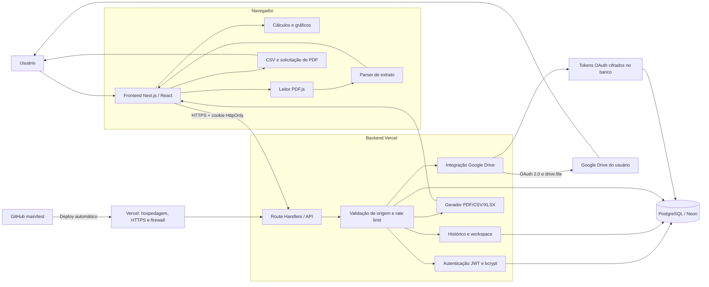
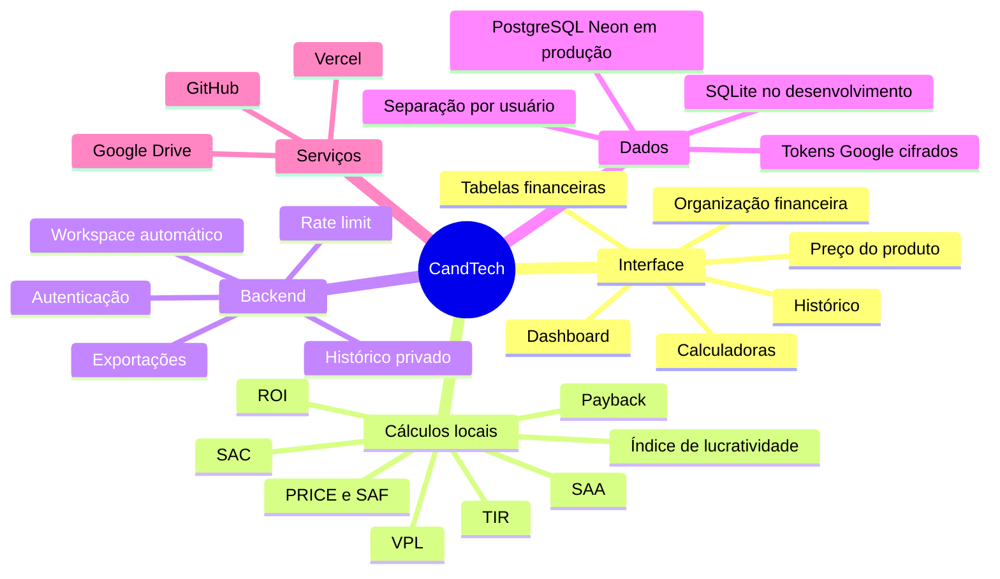
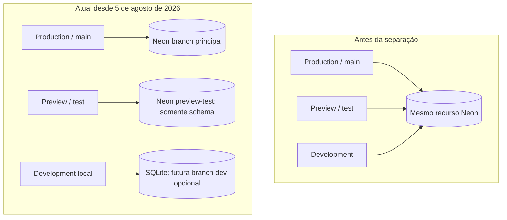

# Mapa do sistema CandTech

O mapa abaixo mostra como navegador, frontend, APIs, banco e serviços externos conversam entre si.

## Leitura como mapa mental

## Limites importantes

- O PDF bruto é processado no navegador; os lançamentos extraídos podem ser salvos no workspace do usuário.
- Os cálculos de investimento são periódicos mensais. As datas identificam os fluxos e a data estimada do payback.
- ROE não pertence ao cálculo de projeto atual. Para calculá-lo corretamente seriam necessários lucro líquido contábil e patrimônio líquido médio.
- PRICE/SAF, SAC e SAA são simulações sem seguros, tarifas, tributos ou indexadores contratuais.

## Funcionamento do banco de dados

### Escolha do backend

`lib/db.js` escolhe o banco no servidor:

1. se `DATABASE_URL` existir, carrega `@neondatabase/serverless` e conecta ao PostgreSQL/Neon;
2. se ela não existir, cria `data/finsight.sqlite` para desenvolvimento local;
3. a Promise de inicialização é reutilizada na mesma instância para evitar inicializações repetidas;
4. `CREATE TABLE IF NOT EXISTS` garante o schema básico, embora migrations versionadas ainda sejam recomendadas antes do uso empresarial.

### Dados persistidos

| Tabela | Conteúdo | Isolamento atual |
| --- | --- | --- |
| `users` | nome, e-mail e hash bcrypt da senha | e-mail único |
| `histories` | documentos e payloads salvos | `user_id` |
| `workspaces` | estado atual e revisão do autosave | uma linha por `user_id` |
| `rate_limits` | contadores temporários de requisição | chave derivada do escopo/origem |
| `google_drive_connections` | refresh token OAuth cifrado | uma linha por `user_id` |
| `auth_sessions` | sessões ativas, expiração e revogação | `user_id` + hash da sessão |
| `billing_profiles` | identificação e endereço de cobrança | uma linha por `user_id` |
| `audit_events` | eventos mínimos de conta, sessão e perfil | `user_id` quando aplicável |

O navegador conversa apenas com as APIs. A API valida o cookie de sessão, extrai o identificador do usuário e consulta o Neon usando esse identificador. A credencial do banco permanece no servidor.

### Ambientes atuais e destino planejado

## Cadastro, assinatura e cobrança futura

- `/assinar` apresenta os planos sem preço e sem iniciar pagamento;
- `/api/profile` grava somente nome, contato e endereço do usuário autenticado; não coleta CPF/CNPJ nesta preparação;
- `billing_profiles` reserva referências futuras ao provedor, mas não armazena cartão, senha bancária ou credencial de conta;
- `auth_sessions` permite expiração absoluta e revogação no logout;
- `audit_events` registra inicialmente conta, sessão e perfil sem copiar documentos completos para os metadados;
- a migração PostgreSQL correspondente está em `migrations/20260806_security_and_billing.sql`;
- quando houver cobrança, o navegador deverá ser direcionado ao componente seguro do provedor e o servidor confirmará o resultado por webhook assinado e idempotente.

Preview recebe sua própria `DATABASE_URL` sensível e não recebe as credenciais da branch de Production. A branch `preview-test` foi criada com schema somente, sem copiar usuários, históricos ou dados financeiros reais. Development não possui credenciais PostgreSQL na Vercel e usa o fallback SQLite, salvo quando o desenvolvedor configura conscientemente uma URL local separada.
