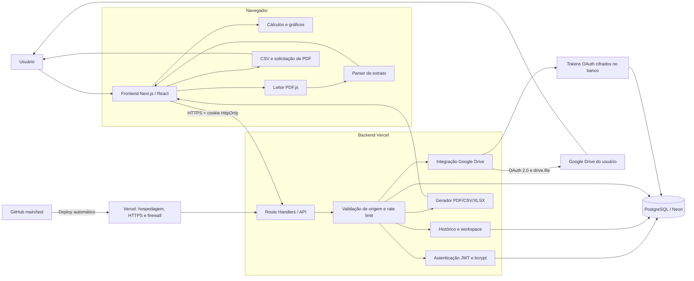
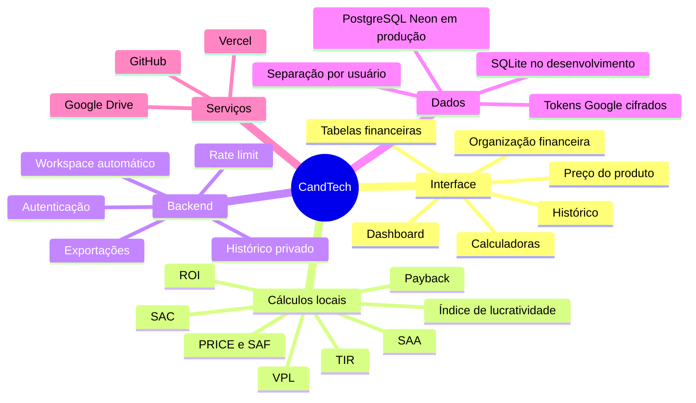

# Mapa do sistema CandTech

O mapa abaixo mostra como navegador, frontend, APIs, banco e serviços externos conversam entre si.

## Leitura como mapa mental

## Limites importantes

- O PDF bruto é processado no navegador; os lançamentos extraídos podem ser salvos no workspace do usuário.
- Os cálculos de investimento são periódicos mensais. As datas identificam os fluxos e a data estimada do payback.
- ROE não pertence ao cálculo de projeto atual. Para calculá-lo corretamente seriam necessários lucro líquido contábil e patrimônio líquido médio.
- PRICE/SAF, SAC e SAA são simulações sem seguros, tarifas, tributos ou indexadores contratuais.
